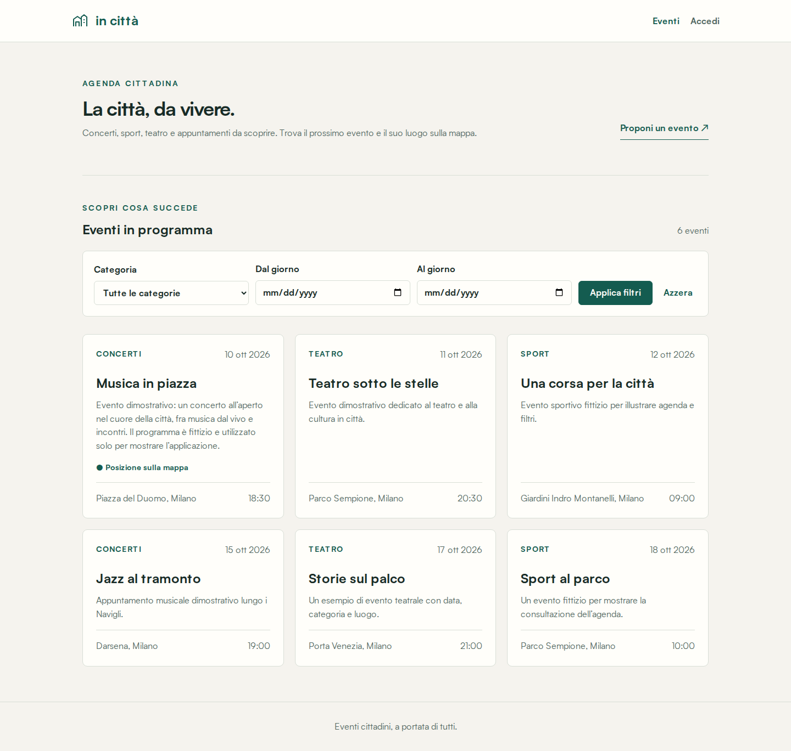
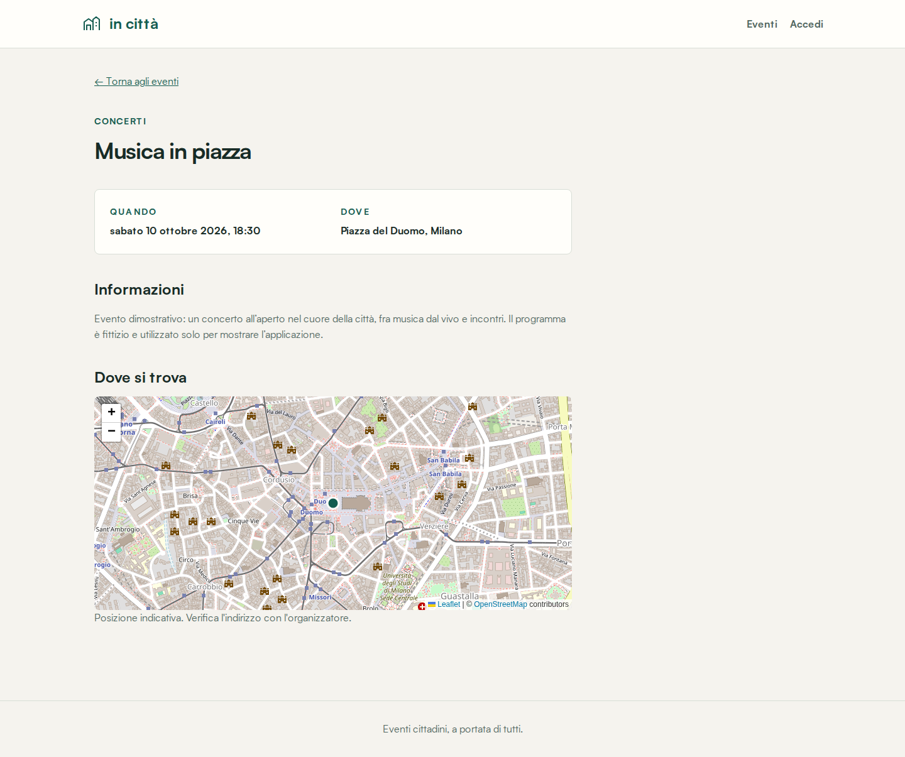

# In Città | Eventi cittadini con Spring Boot, Angular e mappa OpenStreetMap

Applicazione fullstack dimostrativa per consultare e gestire eventi cittadini,
filtrare l'agenda e visualizzare il luogo su una mappa interattiva.
Il [backend Java Spring Boot](demo/README.md) in `demo/` e il
[frontend Angular](event-frontend/README.md) in `event-frontend/` sono parti
dello stesso progetto: Angular chiama le API Spring Boot sotto `/api`;
il proxy di sviluppo e Nginx in Docker inoltrano le richieste al backend.

| Componente | Cartella | Tecnologie e responsabilità |
| --- | --- | --- |
| API e logica eventi | [`demo/`](demo/README.md) | Java 21, Spring Boot 3.5.6, JPA, JWT, Flyway, Swagger, H2/PostgreSQL |
| Interfaccia e mappa | [`event-frontend/`](event-frontend/README.md) | Angular 20, TypeScript, Leaflet, OpenStreetMap, agenda e form eventi |
| Avvio integrato | [`compose.yaml`](compose.yaml) | Docker Compose, PostgreSQL 16 e Nginx con proxy API |

## Anteprima

Screenshot reali dell'applicazione, acquisiti su un'istanza isolata con dati
dimostrativi. Titoli, descrizioni e date non rappresentano un programma
effettivo di eventi cittadini.

### Agenda e filtri

La pagina iniziale mostra gli eventi in ordine cronologico e consente di
filtrare per categoria e intervallo di date.



### Dettaglio con mappa

Un evento con coordinate salvate mostra il luogo sulla mappa Leaflet.
La cartografia visualizzata è di OpenStreetMap, con attribuzione mantenuta
nello screenshot.



## Funzionalità

- **Agenda**: eventi ordinati per data, ricerca per categoria e intervallo di date,
  dettaglio, paginazione e operazioni CRUD.
- **Integrità dei dati**: validazioni (fra cui titolo obbligatorio e data futura) e errori API
  strutturati.
- **Autenticazione e permessi**: registrazione e accesso con JWT; ogni nuovo
  evento appartiene al suo autore. Solo il proprietario o un amministratore
  possono modificarlo o eliminarlo; gli eventi storici senza autore sono
  gestibili esclusivamente dagli amministratori.
- **Localizzazione**: posizione facoltativa con coordinate, selezione su mappa e geocodifica su
  richiesta. Il dettaglio mostra anche i luoghi degli eventi già presenti nel
  database: una mappa se hanno coordinate; altrimenti propone una ricerca del
  luogo a partire dal testo salvato, senza modificare il record.

## Avvio in locale

Servono JDK 21, Maven 3.9+ e Node.js 20.19+ della serie 20 oppure 22.12+
della serie 22, con npm. Prima dell'avvio imposta nel terminale un
`JWT_SECRET` privato casuale di almeno 64 byte UTF-8: ora è obbligatorio
anche con H2. `.env` viene letto da Compose, non automaticamente da Maven.
La [guida migrazioni e sicurezza](docs/MIGRAZIONI-E-SICUREZZA.md) spiega
variabili, amministratori e adozione dei database esistenti.
Poi, dalla radice del repository, apri due terminali:

```bash
cd demo
mvn spring-boot:run
```

```bash
cd event-frontend
npm ci
npm start
```

Apri `http://localhost:4200/`; le API rispondono su
`http://localhost:8080/api`. La configurazione predefinita usa H2 persistente
in `demo/data/`: gli eventi e gli account restano disponibili ai riavvii,
ma il file del database non va pubblicato su Git. Dal frontend puoi registrare
un account e accedere per creare eventi. Il token vive solo nella memoria
della scheda e va richiesto di nuovo dopo un refresh.
Se `demo/data/events.mv.db` esiste già senza cronologia Flyway, non verrà
adottato automaticamente: segui la procedura di backup e verifica nella guida
prima di avviare questa versione.

## Avvio integrato con Docker

**Prima di avviare Compose, compila il backend**: il suo Dockerfile copia
un JAR già esistente e non esegue Maven durante la build dell'immagine.
Servono quindi JDK 21 e Maven anche per questo percorso di avvio.
Dalla radice:

```bash
cd demo
mvn clean package
cd ..
```

Il comando esegue i test e produce `demo/target/demo-0.0.1-SNAPSHOT.jar`.
Copia [`.env.example`](.env.example) in `.env`, se non hai già un file
configurato, e compila entrambi i valori vuoti: `JWT_SECRET` con un valore
privato casuale di almeno 64 byte e `DB_PASSWORD` con una password privata.
Il backend rifiuta segreti mancanti, troppo corti o segnaposto noti;
Compose rifiuta credenziali vuote. Non aggiungere `.env` al repository.

Per generare localmente un segreto in PowerShell, senza inserirne uno fisso
nella documentazione:

```powershell
$bytes = New-Object byte[] 64
$rng = [System.Security.Cryptography.RandomNumberGenerator]::Create()
$rng.GetBytes($bytes)
$rng.Dispose()
[Convert]::ToBase64String($bytes)
```

Usa il risultato come valore di `JWT_SECRET` nel tuo `.env` e non condividerlo.
Prima dell'avvio verifica la configurazione con `docker compose config --quiet`,
che non stampa i valori dei segreti.

```bash
docker compose up --build
```

Frontend: `http://localhost:4200/`; backend:
`http://localhost:8080/`; Swagger:
`http://localhost:8080/swagger-ui/index.html`. PostgreSQL usa un volume
persistente; `docker compose down` lo conserva. **Non usare `docker compose
down -v` se vuoi conservare i dati**: elimina quel volume e i dati contenuti.
Non ci sono segreti JWT o password PostgreSQL di fallback. Le credenziali
configurano solo un nuovo volume: cambiare `.env` non ruota automaticamente
la password di un database già inizializzato.

Le porte host 4200 e 8080 devono essere libere. H2 locale e PostgreSQL Docker
sono database distinti: gli eventi e gli account non vengono trasferiti
automaticamente fra le due modalità.

## Verifica

```bash
cd demo && mvn test
cd ../event-frontend && npm ci && npm run build
npm test -- --watch=false --browsers=ChromeHeadless
```

I test Angular richiedono Chrome/Chromium; configura `CHROME_BIN` se non viene
trovato. I dettagli delle API e delle variabili sono nel
[README backend](demo/README.md), quelli dell'interfaccia nel
[README frontend](event-frontend/README.md).

La [CI GitHub Actions](.github/workflows/ci.yml) esegue i test backend,
la build Angular e i test frontend per push e pull request.
Un job PostgreSQL 16 verifica permessi, migrazioni, conservazione dei dati,
riavvii applicativi e riavvio del container database, oltre ai vincoli Compose.
Non esegue la build e l'avvio completo dei tre servizi Compose.
I test ordinari usano H2 e una chiave pubblica esclusivamente sul classpath
di test; per PostgreSQL usa il database dedicato `in_citta_test`,
come descritto nella [guida](docs/MIGRAZIONI-E-SICUREZZA.md).

## Mappa e dati preesistenti

La ricerca del luogo usa Nominatim dopo un'azione esplicita dell'utente,
senza completamento automatico; l'istanza applica un intervallo minimo di
1,1 secondi fra richieste e una cache in memoria. Per carichi di produzione
usa un servizio compatibile gestito con limiti e cache condivisi
(`GEOCODING_BASE_URL`). Rispetta la
[policy Nominatim](https://operations.osmfoundation.org/policies/nominatim/)
e la [policy dei riquadri OpenStreetMap](https://operations.osmfoundation.org/policies/tiles/).
Le coordinate geocodificate vanno sempre verificate prima del salvataggio.

## Limiti della demo

- **Gestione operativa**: l'autorizzazione proprietario/amministratore è
  implementata, ma non esiste un pannello di amministrazione degli account.
  L'amministratore iniziale viene creato solo con una procedura offline esplicita.
- **Dati e credenziali**: Flyway gestisce le migrazioni e Hibernate valida
  lo schema, ma restano necessari backup verificati, rotazione dei segreti e
  una procedura controllata per gli archivi preesistenti.
- **Servizi esterni**: mappe e geocodifica richiedono connettività e dipendono
  dalla disponibilità e dai limiti dei servizi OpenStreetMap/Nominatim.
- **Sessione e date**: il JWT resta in memoria e viene perso al refresh;
  le date sono locali, senza offset o gestione esplicita dei fusi orari.

Il progetto è adatto a esercitazioni e dimostrazioni tecniche. Non è un sistema
pronto per l'esposizione pubblica: prima servono gestione operativa,
HTTPS, revisione della configurazione di deployment e una verifica di sicurezza dedicata.

## Clonare e aggiornare il progetto

La radice del repository contiene sia `demo/` sia `event-frontend/`.
Clona il progetto in una cartella locale:

```bash
git clone https://github.com/marcyborg/in-citta-eventi-fullstack.git
cd in-citta-eventi-fullstack
```

Per aggiornare un clone esistente, conserva prima eventuali modifiche locali,
poi esegui `git switch main` e `git pull --ff-only origin main`.

`.gitignore` esclude `target/`, `dist/`, `node_modules/`, cache Angular,
database locali, segreti `.env` e output JavaScript generati. Conserva
`package-lock.json` per installazioni riproducibili; non inserire mai
credenziali o dati personali negli esempi e nei commit.

## Licenza e contenuti di terze parti

Il codice del progetto è distribuito con [licenza MIT](LICENSE),
copyright 2026 Francesco Marchitelli. Il testo della licenza definisce
permessi, condizioni e limitazioni di responsabilità.

Le dipendenze mantengono le rispettive licenze; la licenza del progetto
non sostituisce quelle dei contenuti di terze parti.
La cartografia e i dati OpenStreetMap, inclusi quelli visibili negli screenshot,
restano soggetti alle relative condizioni e attribuzioni:
[OpenStreetMap copyright e licenza](https://www.openstreetmap.org/copyright).
